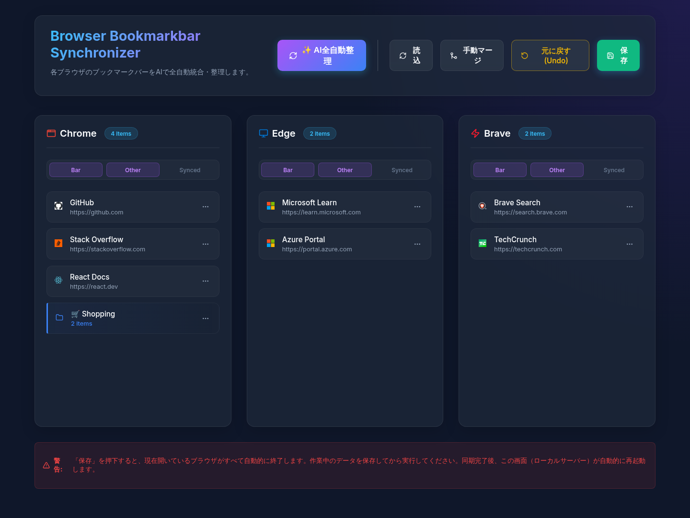

# 🧠 AI Bookmark Organizer (Chrome, Edge, Brave Sync Tool)

> **Got 500+ bookmarks scattered across Chrome, Edge, and Brave? This fixes that.**  
> **Tested with 1,000+ bookmarks. Still clean.**

Stop wasting time searching bookmarks.  
Let AI clean, deduplicate, and categorize everything — instantly.

ブラウザの「ぐちゃぐちゃブックマーク」を、AIがワンクリックで完全自動整理。

[](https://github.com/charge0315/browser-bookmarkbar-synchronizer/stargazers)


👇 See it in action below

## 🎬 Demo


## 📸 Screenshots



> **The Precision Dashboard.** Manage bookmarks across Chrome, Edge, and Brave with real-time AI progress logs. (Displayed with clean sample data)  
> （精密なダッシュボードUI。Chrome, Edge, Braveのブックマークを、AIのリアルタイム進捗ログとともに管理できます。 ※画像はサンプルデータを使用した表示例です。）

> **⚡ Watch AI turn chaos into structure in seconds.**  
> Before: Messy, duplicated, scattered bookmarks.  
> After: Clean, categorized, synced perfectly across Chromium browsers.

## ✨ Features

- **🤖 Multi-Perspective AI Organization**  
  Select from multiple categorization styles (Standard, Functional, or Topic-based) to organize your bookmarks exactly how you like.  
  （標準・目的別・分野別など、AIが提案する複数のパターンの分類案から好きなものを選択して適用できます）

- **📂 Deep AI Categorization**  
  Smartly handles large folders (>20 items) by recursively creating sub-categories to keep your bookmark bar clean.  
  （20件以上のアイテムがある場合はAIがさらに小分類を自動生成し、階層構造で整理します）

- **🧬 Integrity & Data Safety**  
  Never lose a bookmark. Any items the AI fails to categorize are automatically placed in a `📦 未分類 (要確認)` folder.  
  （AIが分類しきれなかったブックマークは「未分類」フォルダに自動救済。データの欠落を物理的に防ぎます）

- **🤝 Unified Merge Engine & Root Selection**  
  Extracts and deduplicates bookmarks from **specific roots** you choose (Bookmark Bar, Other Bookmarks, or Synced Bookmarks).  
  （各ブラウザの「ブックマークバー」「その他のブックマーク」「同期済みブックマーク」から、同期対象に含めるルートを個別に選択・マージできます）

- **🛡️ Sync Source Protection (Preservation Mode)**  
  Unselected bookmark roots are safely preserved. For example, you can organize your local bookmark bar while keeping your account-synced bookmarks untouched.  
  （選択しなかったルートのデータは保護され、削除されません。アカウント同期されたブックマークを汚さずにローカルバーだけを整理するといった運用が可能です）

- **🔄 Enhanced Sync Reliability**  
  Specifically handles Chromium sync metadata and checksums to prevent the browser from reverting your changes.  
  （ブラウザの同期機能によって勝手に元に戻される問題に対処済み。メタデータとチェックサムを自動調整します）

- **🔙 Integrated Rollback**  
  Made a mistake? Restore your previous bookmark state with a single click.  
  （AIによる整理結果が気に入らない場合、ボタン一つですぐに元の状態へ戻せます）

## 🤔 Why This Exists?

Managing bookmarks across multiple browsers is painful.
Duplicates, outdated links, no structure.
This tool exists to fix that — automatically.

（複数ブラウザを使っていると「あのブックマークどこだっけ？」が頻発します。手動でのマージ対応は諦め、各ブラウザのブックマークバーをAIにより一撃で統合・整理させるために開発されました。）

## 🔒 Privacy & Safety / プライバシーと安全性

**Your bookmarks never leave your machine — except minimal metadata for AI processing.**

- ⚠️ **Important Privacy Note / プライバシーに関する重要な注意事項:**  
  This tool uses the **Gemini API** for organization. This means your bookmark titles and URLs are sent to Google's servers. By using this tool, you acknowledge that you are sharing information about your personal interests, preferences, and browsing habits with the AI service provider.  
  （本ツールは整理のために **Gemini API** を使用します。これは、ブックマークのタイトルとURLがGoogleのサーバーに送信されることを意味します。本ツールを使用することで、個人の趣味・嗜好や閲覧傾向に関する情報がAIサービスプロバイダーに共有されることを理解し、同意したものとみなされます。）

- 💻 **100% Local Execution:** Edits and writes directly to local browser filesystem.
- 🛡️ **No Cloud Storage:** No bookmark data is ever stored on external databases.
- 🧠 **Minimal Context:** Only URLs and bookmark titles are sent to Gemini API.
- ♻️ **Auto-Rollback Safe Write:** Before saving, a backup (`Bookmarks.bak_antigravity`) is created. If writing fails for any reason, it will automatically roll back to prevent data corruption.
- 🛠️ **Preference Repair:** Automatically fixes browser Preferences files after sync to prevent "Restore Pages" crash dialogs.

### 📁 Target Files (Current User Scope)

This tool only affects the **currently logged-in Windows user**. It does not access or modify other users' data. The following files are targeted:

- **Chrome:** `%LOCALAPPDATA%\Google\Chrome\User Data\Default\Bookmarks`
- **Edge:** `%LOCALAPPDATA%\Microsoft\Edge\User Data\Default\Bookmarks`
- **Brave:** `%LOCALAPPDATA%\BraveSoftware\Brave-Browser\User Data\Default\Bookmarks`


> **⚠️ 重要な注意事項 / Warning**
> 本ツールはローカルブックマークファイルを直接上書きします。実行前に必ずブラウザ標準のブックマークマネージャー等でバックアップ（HTMLエクスポート）を取得してください。/ Always backup your bookmarks manually before letting AI override them.

## ⭐ Early Feedback

> "Finally cleaned my 800 bookmarks in seconds."  
> — Early user

## 🛠️ Tech Stack

| Category | Technology |
| --- | --- |
| **Frontend** | React, Vite, @dnd-kit/core |
| **Backend** | Node.js, Express |
| **AI Integration** | @google/generative-ai (Gemini 1.5 Flash/Pro) |

## 🚀 Getting Started / 始め方

> ⚠️ **Platform Target:** The default local browser bookmark path detection is designed for **Windows OS**. For Mac/Linux, you will need to manually update paths in `server/utils/path-finder.js`.  
> （デフォルトのパス検出は **Windows** 向けに設計されています。Mac/Linuxで使用する場合は `server/utils/path-finder.js` 内のパスを適宜書き換えてください。）

### 1. Prerequisites / 必須環境
- Node.js `v18.0` or higher
- **Gemini API Key / Gemini APIキー**
  - Obtain a free API key from [Google AI Studio](https://aistudio.google.com/app/apikey).
  - （[Google AI Studio](https://aistudio.google.com/app/apikey) にアクセスし、Googleアカウントでログインして「Create API key」から無料のキーを取得してください。）

### 2. Clone the Repository / リポジトリのクローン
```bash
git clone https://github.com/charge0315/browser-bookmarkbar-synchronizer.git
cd browser-bookmarkbar-synchronizer
```

### 3. API Setup / APIキーの設定
Create an `.env` file inside the `server/` directory and set your API key.  
（`server/` ディレクトリ内に `.env` ファイルを作成し、APIキーを設定してください。）
```bash
GEMINI_API_KEY=your_api_key_here
```

### 4. Install & Run / インストールと実行
Open two terminals and run the following:  
（2つのターミナルを開き、それぞれ以下を実行してください。）

**Terminal 1: Backend / バックエンド**
```bash
cd server
npm install
npm run dev
```

**Terminal 2: Frontend / フロントエンド**
```bash
cd client
npm install
npm run dev
```

### 5. Execution / 実行
Launch `http://localhost:5173`. Select your root sources (Bar, Other, Synced) and click the **"✨ AI全自動整理"** button!  
（ブラウザで `http://localhost:5173` を開き、同期対象のルートを選択してから「✨ AI全自動整理」ボタンをクリックしてください！）

*(The tool will automatically handle closing and restarting your browsers when you apply changes)*  
（保存を適用すると、ブラウザは自動的に一度終了し、再起動されます）


## 🚧 Roadmap

- [x] Undo / History (Local Backup Manager)
- [x] Smart Auto-Reboot & Preferences repair
- [x] Recursive Sub-categorization
- [ ] Local LLM support (Offline mode)
- [ ] Smart rules (Regex-based categories without AI)


## 🤝 Contributing

We love your input! We want to make contributing to this project as easy and transparent as possible.
- **Bug Reports:** Open an issue with reproduction steps.
- **Feature Requests:** Share your ideas in the issues tab.
- **Code Contributions:** Fork the repo, create a branch, and submit a PR!

---

**If this saved you even 10 minutes, give it a ⭐**  
**It helps more people discover it 🙌**

## 📄 License
MIT © [charge0315](https://github.com/charge0315)
